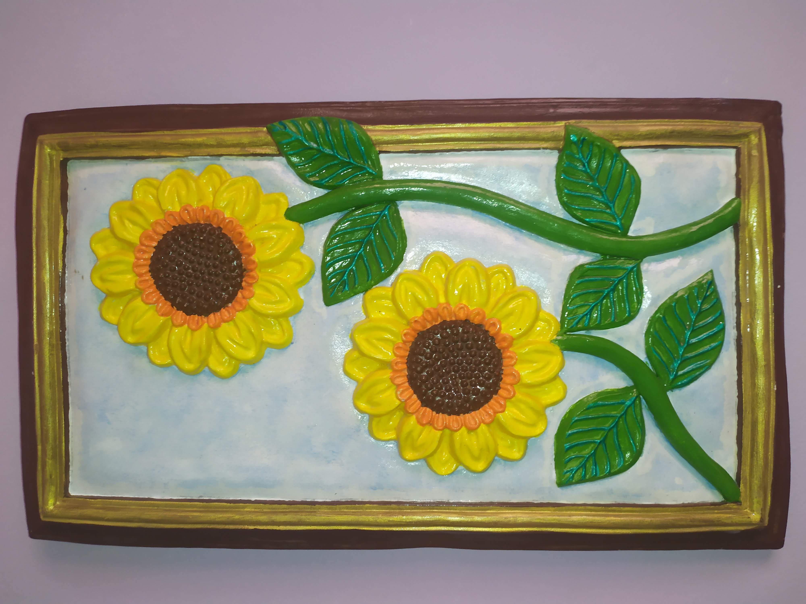
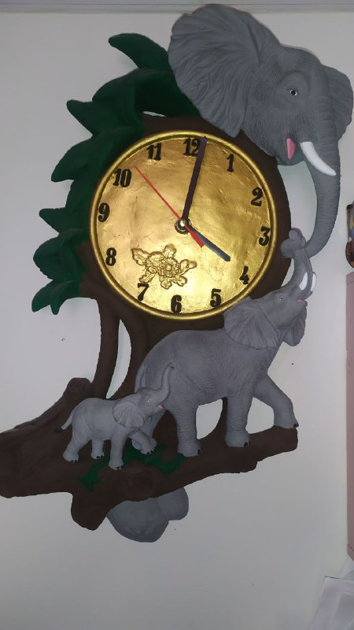
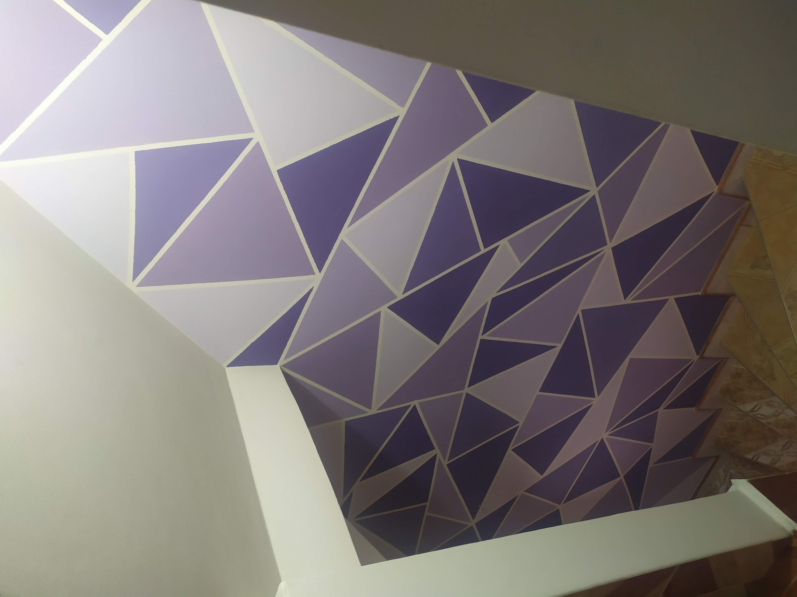

<a href="/" style="background:#00d69f;
border-radius: 5px;border:none;outline:none;
padding: 8px 10px;color: black;">
      Volver a inicio
</a>

## ***Menú***
### [*¿Conóceme?*](./about.md)
### [*Mis proyectos*](./gallery.md)
### [*Te ofrezco*](./services.md)
### [*Contáctame*](./contact.md)
# **Estos son algunos de los proyectos destacados**

## **Abstractos  🖌**

  

## **Figuras en yeso y cerámicas🖌**

## **Lienzos🖌**

## **Paredes 🖌**

